| Nama      | Risky HariAdi |
| ----------- | ----------- |
| NIM     | 312010124       |
| Kelas   | TI.20.A.1        |

## Langkah langkah praktikum 5
Persiapan membuat dokumen HTML dengan nama file lab5_javascript.html seperti berikut.

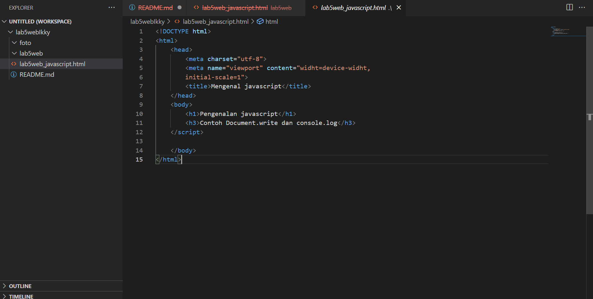

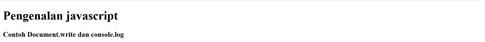

## 1. Javascript Dasar
Pemakaian Alert sebagai property window

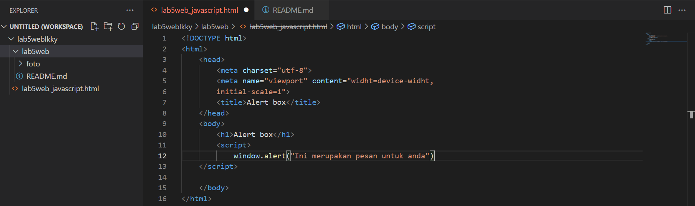

Hasilnya
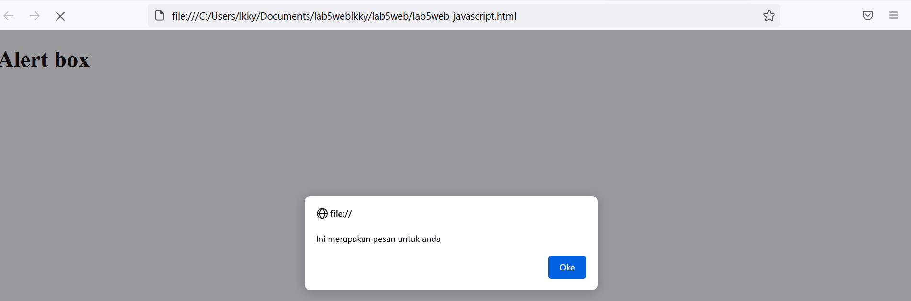
Pemakaian method dalam objek

Hasilnya
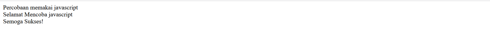

Pemakaian Prompt

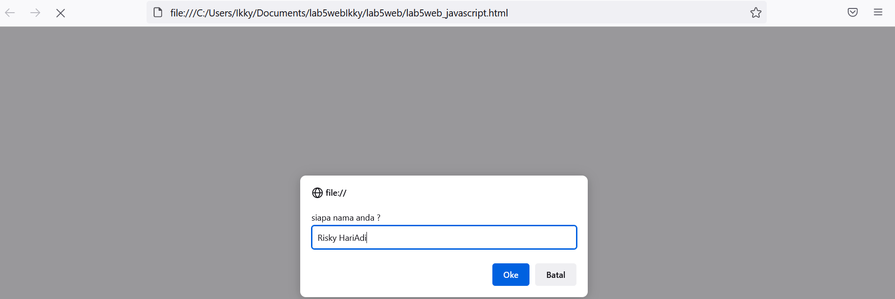
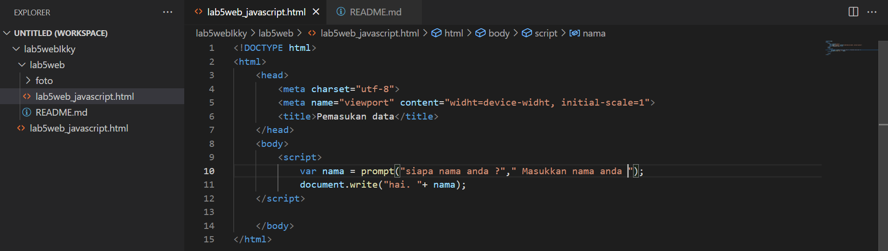
Hasilnya
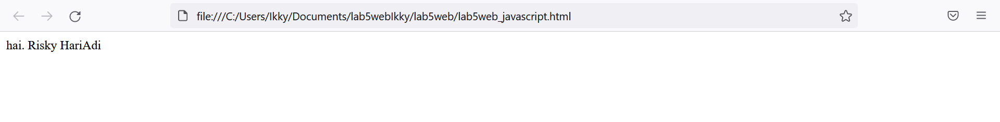

Pembuatan fungsi dan cara pemanggilannya

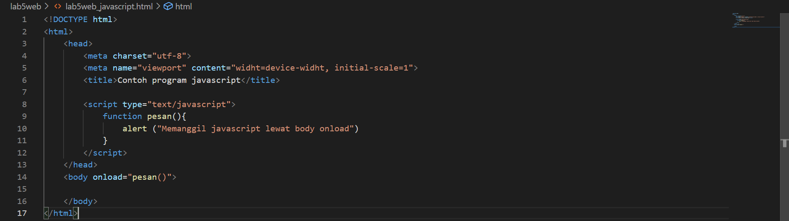

Hasilnya

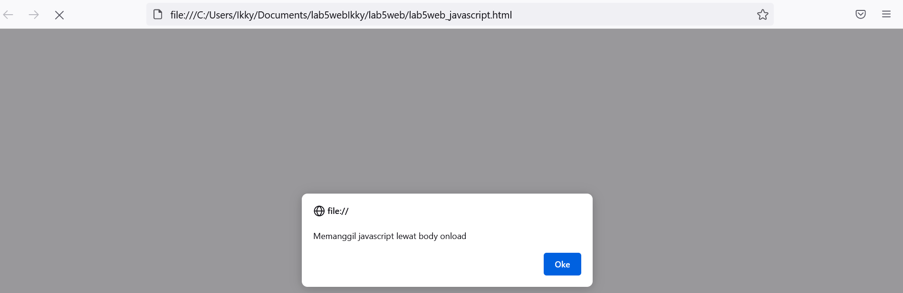
## 2. Dasar Pemrograman Di Javascript
Operasi dasar aritmatika

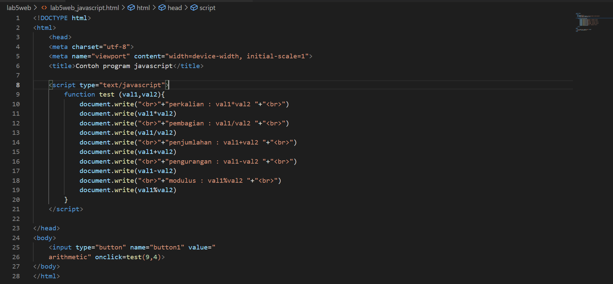

Hasilnya
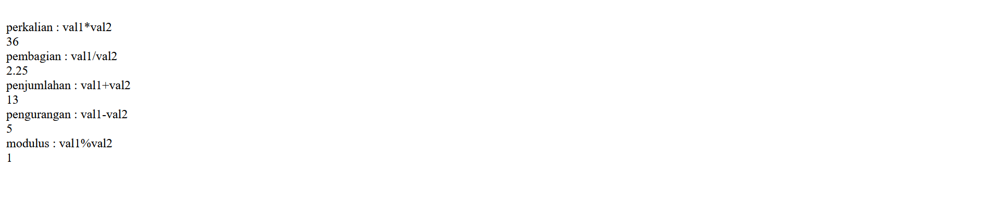

Seleksi kondisi (if..else)

disini saya memasukkan data 70

Angka yang saya masukkan 70
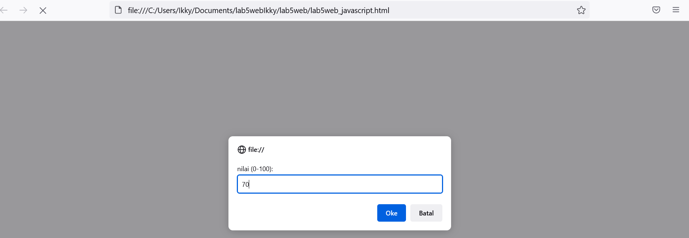

Hasilnya 

Penggunaan operator switch untuk seleksi kondisi

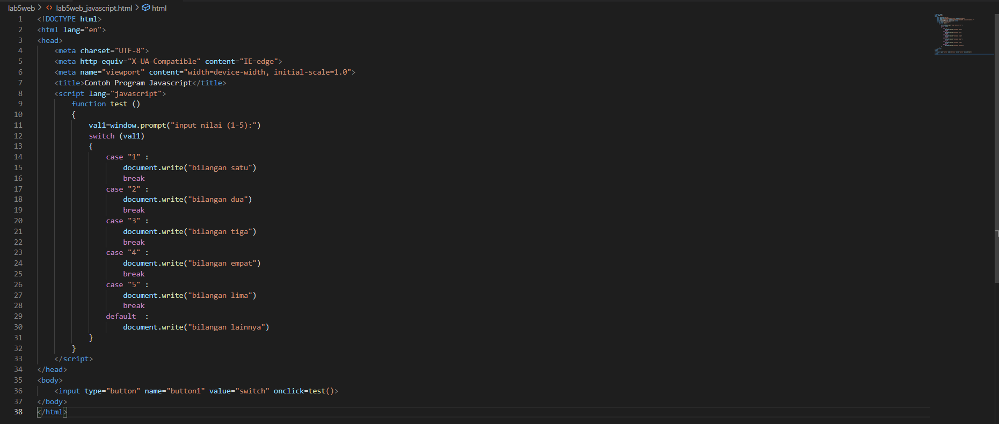

Angka yang saya masukkan

Hasilnya 

## 3. pembuatan Form
Form input

saya coba input nilai 8

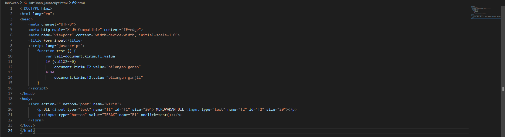

Hasilnya 
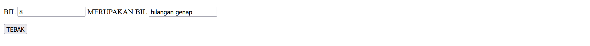

Form button

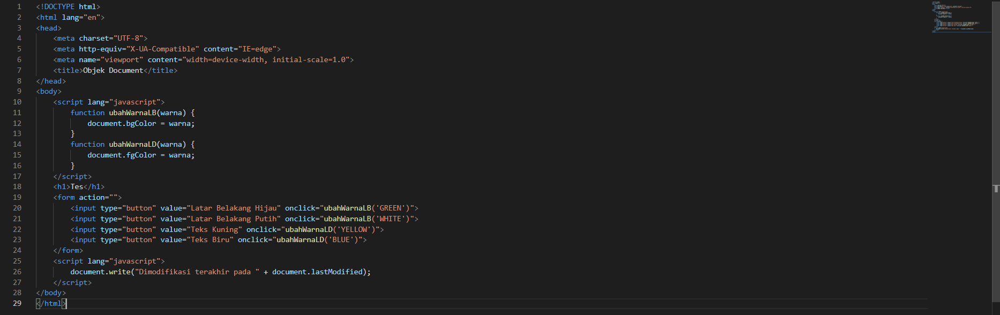

Hasilnya

## 4. HTML DOM
Pilihan menggunakan checkBox dengan perhitungan otomatis

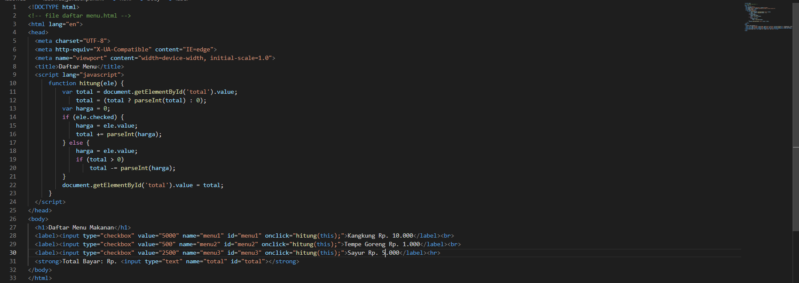

Hasilnya
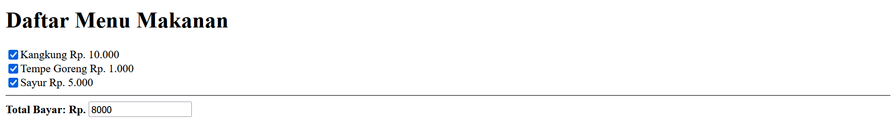

## Pertanyaan dan Tugas
1. Buat script untuk melakukan validasi pada isian form

## Jawab

Membuat validasi nama, no.telp, Email,alamat

## 1.BUAT SCRIPT UNTUK MELAKUKAN VALIDASI PADA ISIAN FORM.

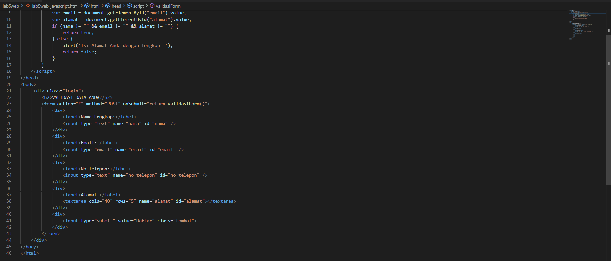

PENJELASAN

Ini adalah contoh membuat form validasi dengan menggunakan script atau javascript terdapat beberapa pengondisian, jika data tidak di isi dengan lengkap maka akan terdapat prompt isi alamat anda dengan lengkap karena harus mengisi dengan lengkap seperti contoh gambar di atas

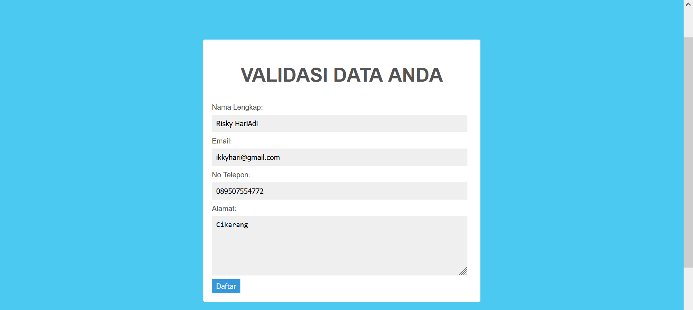